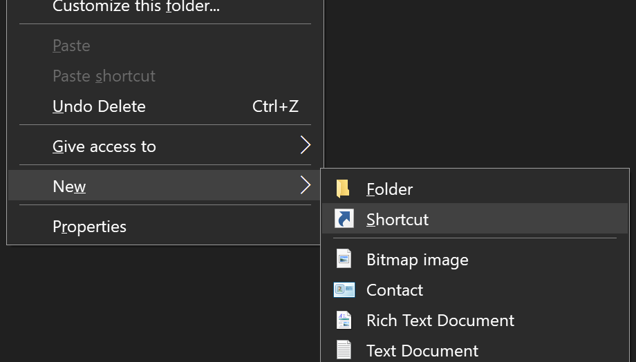
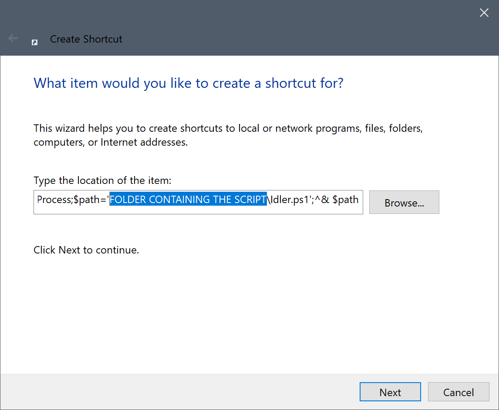
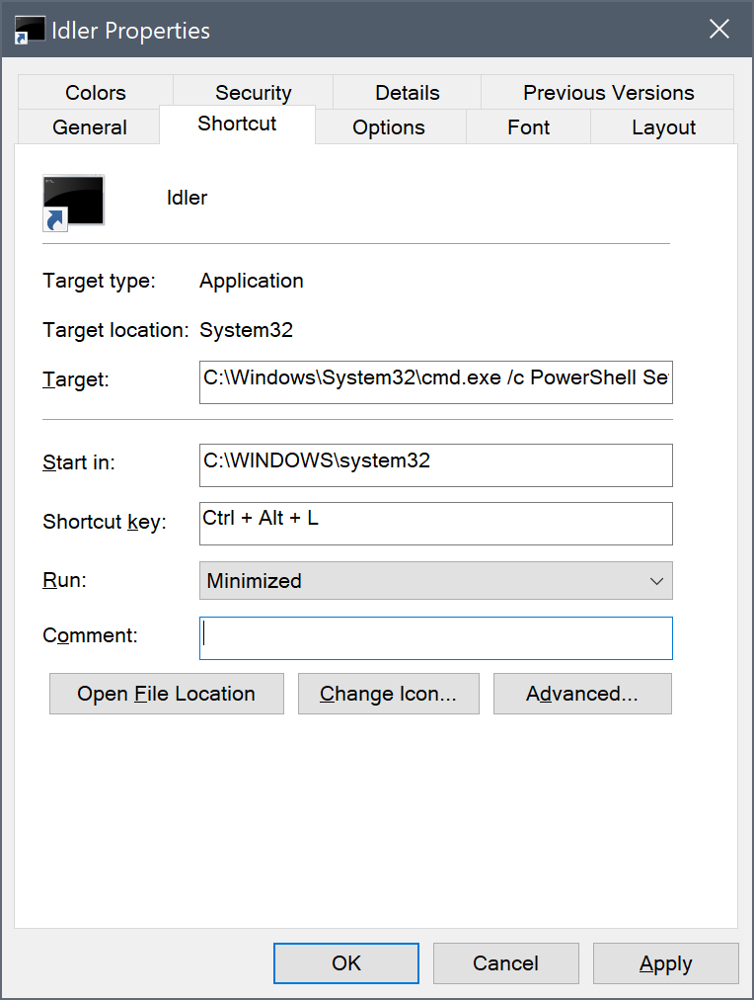

# Windows-Idler

To keep away low-threat individuals (e.g. kids) from messing around your computer, it is best to lock your computer.
However, there are times when you want to leave some processes working in the background, thus you may want a way to lock your computer while preventing your computer from putting into sleep. This PowerShell script provides a way for you to let your computer idle and process whatever you want in the background.

You can use Idler when you are:
* running backups
* running antimalware software
* running to restroom in the middle of playing games
* playing music in the background
* downloading files
* etc.

## Advanced Usage

Normally, you need to right-click a Windows PowerShell Script(.ps1) and click "Run with PowerShell" to execute the script.  
But, if you create a shortcut file(.lnk), you can double click or even use "Shortcut key" to execute the script.  

How to setup:  

1. On desktop, follow **right-click > New > Shortcut**  



---

2. When you see the Create Shortcut window, paste the below code.  
Replace **FOLDER CONTAINING THE SCRIPT** with the location of a folder containing the script.  

```C:\Windows\System32\cmd.exe /c PowerShell Set-ExecutionPolicy Bypass -Scope Process;$path='FOLDER CONTAINING THE SCRIPT\Idler.ps1';^& $path```


  
---

3. Once you create a shortcut file in the Desktop folder, you can go to shortcut file's properties and define options such as **Shortcut Key**. In this example, the option is set to `Crtl + Alt + L`. From now on, whenever desired, Idler can be activated via `Crtl + Alt + L` key combo.


  
## Acknowledgments

* Hat tip to anyone whose code was used
